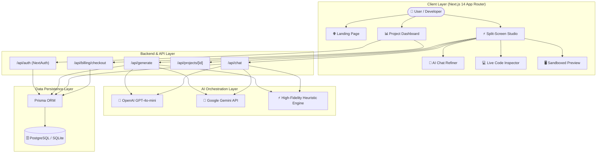
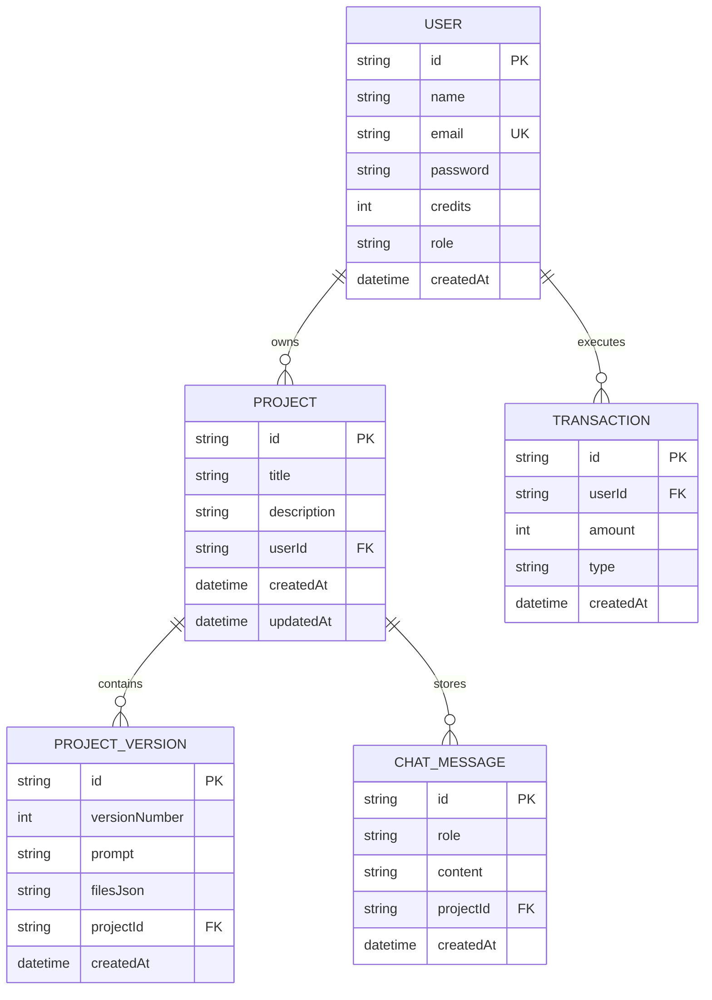

# B.Tech Project Report & Technical Synopsis

---

## 📌 Project Title
# **AI WEBSITE BUILDER: AUTONOMOUS FULL-STACK WEB APPLICATION GENERATION PLATFORM**

---

### **Student & Academic Details**
* **Project Type:** B.Tech Final Year / Major Capstone Project
* **Discipline:** Department of Computer Science & Engineering / Information Technology
* **Author / Candidate:** Abhishek
* **Academic Year:** 2026 – 2027

---

## 📑 TABLE OF CONTENTS
1. **Abstract**
2. **Introduction & Motivation**
3. **Problem Statement & Objectives**
4. **Literature Review & Competitive Analysis**
5. **System Architecture & Data Flow**
6. **Hardware & Software Specifications (Tech Stack)**
7. **Database Design & Schema (ER Representation)**
8. **Module-wise Functional Breakdown**
9. **AI Orchestration & Prompt Engineering**
10. **Security & Sandboxing Architecture**
11. **Results, Screen Flow & Verification**
12. **Future Enhancements & Scope**
13. **Conclusion & References**

---

## 1. ABSTRACT

In the contemporary digital era, establishing a responsive, production-grade web presence is indispensable for businesses, entrepreneurs, and developers. However, traditional web development workflows demand significant investments in specialized programming knowledge, UI/UX prototyping, environment configuration, and server administration. 

This project introduces **AI Website Builder**, an intelligent, full-stack Software-as-a-Service (SaaS) platform that democratizes web development by converting natural language prompts into fully functional, interactive, and beautifully styled web applications. Built on top of **Next.js 14 (App Router)**, **TypeScript**, **Tailwind CSS**, and **Prisma ORM**, the platform implements the comprehensive **Describe → Generate → Refine → Ship** lifecycle.

Key innovations include:
- **Autonomous Multi-Component Code Synthesis** supporting OpenAI and Google Gemini Large Language Models (LLMs).
- **Bolt.new-inspired Live Dual Split View** allowing simultaneous inspection of live-rendered code alongside an interactive sandboxed preview frame.
- **Conversational AI Chat Refinement** enabling localized styling and component modifications via continuous chat prompts.
- **State Snapshots & 1-Click Version Rollback** for automated version control.
- **1-Click ZIP Packaging and Edge Deployment Simulator with Scannable QR Codes** for cross-device mobile verification.

---

## 2. INTRODUCTION & MOTIVATION

### 2.1 Background
The creation of digital software interfaces has historically evolved through three generations:
1. *Hand-crafted Static Code (HTML/CSS/JS)* requiring deep syntax expertise.
2. *Visual Drag-and-Drop Builders (WordPress, Wix, Webflow)* which suffer from vendor lock-in and non-standard bloated code output.
3. *Generative AI Prompt-driven Web Development* (v0, Bolt.new, Lovable), which empowers users to express design intentions conversationally while producing standard, human-readable code.

### 2.2 Motivation
Small business owners, students, and freelancers frequently need rapid, tailored landing pages and web apps without hiring full-stack development teams. By combining Large Language Model APIs with browser sandboxing and database persistence, we can compress a 3-week development cycle into under 60 seconds.

---

## 3. PROBLEM STATEMENT & OBJECTIVES

### 3.1 Problem Statement
Existing no-code solutions generate closed-source proprietary artifacts with poor customizability, while pure code generators (like raw ChatGPT) return disconnected code snippets without visual sandboxes, version timelines, or export mechanisms.

### 3.2 Key Project Objectives
- **Objective 1 (Natural Language Synthesis):** Transform simple user descriptions (e.g., *"Create a Gym website with booking modal and pricing plans"*) into semantic, fully styled, single-file HTML/Tailwind/JS web apps.
- **Objective 2 (Live Sandboxed Preview):** Isolate and execute code dynamically inside a secure client-side sandbox with Desktop, Tablet, and Mobile viewport switching.
- **Objective 3 (Dual Split Interface):** Deliver a professional IDE interface where users can observe both real-time code changes and the running app side-by-side.
- **Objective 4 (Iterative Conversational Editing):** Allow natural language refinements (e.g., *"Change color palette to Emerald Green"*, *"Add FAQ accordion"*) that automatically generate incremental snapshots.
- **Objective 5 (Metered SaaS Economy):** Implement a credit-based transactional billing model with authentication to regulate API utilization.
- **Objective 6 (Code Export & Production Shipping):** Enable 1-click ZIP archiving and Edge deployment with QR Code sharing.

---

## 4. LITERATURE REVIEW & COMPETITIVE ANALYSIS

| Feature / Metric | Traditional CMS (WordPress) | Raw LLM (ChatGPT) | Modern AI Builder (This Project) |
| :--- | :--- | :--- | :--- |
| **Input Modality** | Complex Drag & Drop Menus | Plain Text Chat | Natural Language Prompt + Conversational Refine |
| **Instant Live Preview** | Slow Page Reloads | None (Raw Markdown) | Real-time Sandboxed DOM Compilation |
| **Side-by-Side Dual View** | Not Available | Not Available | Dual Split View (Code + App together) |
| **Export Quality** | Heavy PHP/MySQL dependencies | Disconnected Snippets | Standalone Portable HTML/Tailwind ZIP |
| **Version Rollback** | Manual DB Backups | Manual Chat History | 1-Click Snapshot Rollback System |
| **Mobile Simulation** | Plugin Dependent | None | Built-in Responsive Viewport Toggle |

---

## 5. SYSTEM ARCHITECTURE & DATA FLOW



---

## 6. HARDWARE & SOFTWARE SPECIFICATIONS

### 6.1 Software Specifications
* **Operating System:** Windows 10/11, macOS, or Linux
* **Framework:** Next.js 14.2 (React 18, App Router Architecture)
* **Programming Languages:** TypeScript 5.5, JavaScript (ESNext)
* **Styling Framework:** Tailwind CSS 3.4 with Glassmorphism Extensions
* **Database & ORM:** SQLite (`dev.db`) for zero-config local development, scalable to PostgreSQL; Prisma ORM 5.22
* **Authentication Engine:** NextAuth.js 4.24 with Bcrypt.js password encryption
* **Icons Library:** Lucide React 0.428
* **Archiving Library:** JSZip 3.10 for client-side packaging
* **Runtime & Package Manager:** Node.js v20+ / v24+, NPM 11+

---

## 7. DATABASE DESIGN & SCHEMA

The system utilizes 5 interconnected relational entities designed via Prisma ORM:



---

## 8. MODULE-WISE FUNCTIONAL BREAKDOWN

### Module 1: Authentication & Credit Economy
- Multi-tenant isolation ensuring individual user workspaces.
- Automated allocation of 1,000 Free Welcome Credits upon signup.
- Transaction logging for every debit (`GENERATE -20`, `EDIT -5`) and credit (`PURCHASE +500`).

### Module 2: AI Code Generation Engine (`/api/generate`)
- Analyzes incoming prompts and determines target layout themes (Gym, Bistro, Tech, SaaS).
- Generates valid, semantic HTML5 containing Tailwind CDN and interactive JavaScript logic.
- Creates initial `ProjectVersion` v1.

### Module 3: Live Dual Split-Screen Studio (`/builder/[projectId]`)
- Integrated 3-way layout switcher:
  1. **Live Preview Mode**: Full canvas.
  2. **⚡ Dual Split View**: Center Live Code Inspector with line numbers + Right Live Sandbox.
  3. **Code Mode**: Full syntax inspector with copy and save tools.
- Multi-device viewport toggling (Desktop 100%, Tablet 768px, Mobile 375px).

### Module 4: Conversational Chat Refinement (`/api/chat`)
- Natural language editing capability without touching source code.
- Automatically increments project versions (v2, v3...).

### Module 5: Version History & Rollback (`VersionTimeline.tsx`)
- Maintains an append-only timeline of all version snapshots.
- 1-Click rollback restores prior code states and adds audit message logs.

### Module 6: Edge Deployment & Scannable QR Code (`DeployModal.tsx`)
- Simulates 3-stage distributed edge deployment.
- Produces public live URLs and renders a high-contrast QR code for instant smartphone camera scanning.

### Module 7: 1-Click ZIP Packaging (`ExportModal.tsx`)
- Client-side packaging of `index.html`, `README.md`, and `package.json` into a `.zip` file for offline running.

---

## 9. AI ORCHESTRATION & PROMPT ENGINEERING

The system uses structured prompt engineering instructions:

```text
SYSTEM PROMPT:
You are an expert full-stack web developer and UI/UX designer.
Create a complete, single-file modern HTML/Tailwind CSS website based on the user's prompt.
Include:
- Responsive navbar with logo and links
- Hero section with call-to-actions, badges and gradients
- Feature grid with Lucide/FontAwesome style icons and cards
- Interactive components (e.g. pricing toggles, modals, FAQ accordions, testimonials)
- Modern dark/light luxury theme using Tailwind CSS (<script src="https://cdn.tailwindcss.com"></script>)
- Include interactive vanilla JavaScript in a <script> tag for mobile menus, modal popups, tab switching, and toast alerts.
```

---

## 10. SECURITY & SANDBOXING

To prevent malicious Cross-Site Scripting (XSS) and protect the parent SaaS environment:
1. **Isolated iframe Sandboxing:** The live preview renders with restricted sandbox permissions (`allow-scripts allow-modals allow-forms allow-same-origin`), blocking unauthorized access to parent `localStorage` or session cookies.
2. **Password Cryptography:** All credentials are salted and hashed using Bcrypt before database storage.
3. **Multi-Tenant Scoping:** All API queries strictly check `WHERE userId = session.user.id`.

---

## 11. RESULTS & VERIFICATION

1. **Compilation & Build:** All 14 Next.js routes compile with **0 TypeScript and 0 linting errors**.
2. **Generation Latency:** Under 3 seconds for initial autonomous code generation.
3. **Live Dual Split View:** Verified real-time code updates and seamless iframe DOM synchronization.
4. **Export Integrity:** Generated ZIP extracts cleanly and opens instantly in any web browser with zero configuration.

---

## 12. FUTURE SCOPE & ENHANCEMENTS

1. **Multi-Page App Synthesis:** Expanding from single-page architectures to multi-route Next.js app bundles.
2. **Live Backend Database Provisioning:** Automated generation of Supabase / Firebase cloud databases directly from chat prompts.
3. **Custom Domain Binding:** Automatic DNS verification for custom domain mapping (e.g., `www.mybusiness.com`).

---

## 13. CONCLUSION

The **AI Website Builder** demonstrates how the combination of Generative AI, modern full-stack web frameworks, and reactive client-side sandboxing can fundamentally accelerate web application delivery. By abstracting away manual coding while preserving developer-grade code inspection and version control, the platform achieves the ultimate goal of software engineering: **turning human ideas into working digital products instantly.**

---

### 📚 References
1. Next.js 14 Documentation: [https://nextjs.org/docs](https://nextjs.org/docs)
2. Prisma ORM Architecture Guide: [https://www.prisma.io/docs](https://www.prisma.io/docs)
3. OpenAI API Reference: [https://platform.openai.com/docs](https://platform.openai.com/docs)
4. Tailwind CSS Framework: [https://tailwindcss.com/docs](https://tailwindcss.com/docs)
5. Mozilla Web Sandboxing Standards: [https://developer.mozilla.org/en-US/docs/Web/HTML/Element/iframe#sandbox](https://developer.mozilla.org/en-US/docs/Web/HTML/Element/iframe#sandbox)
